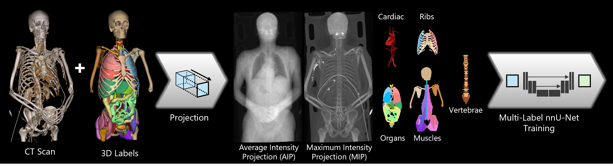
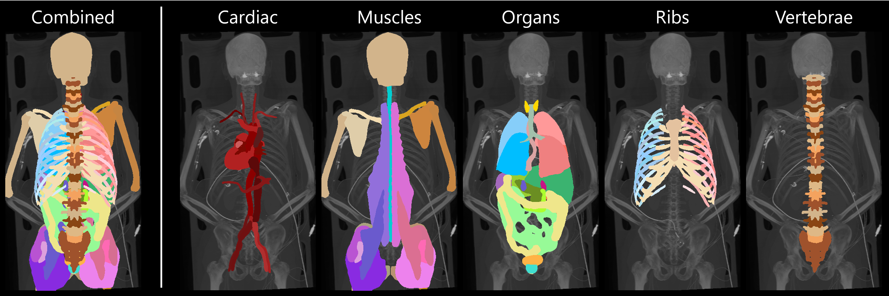

# TotalSegmentator 2D: A Tool for Rapid Anatomical Structure Analysis
> ⚠️ **Note:** This is a preview version and may be incomplete or subject to changes.

## About

**TotalSegmentator 2D (TS2D)** is a tool for fast and efficient anatomical structure segmentation and analysis. **TS2D** is built upon the **TotalSegmentator** dataset and tool, but adopts a 2D projection approach to enable rapid inference and reduced resource consumption. It is designed to segment a variety of anatomical structures in medical images and supports a broad range of applications. The resulting segmentations are used to infer the presence of specific anatomical structures within the image.

TS2D has been used for:
- Anatomical structure segmentation and analysis in CT and X-Ray images.
- Body-region segmentation and detection in CT scans.

_Figure 1: Overview of our method. The volumetric scan ($I_{3D}$) and ground-truth labels ($T_{3D}$) are projected onto the coronal plane to train 2D U-Net model(s). The trained models can then efficiently infer 2D labels ($L_{2D}$) for any projected CT scan._

# Method

TS2D uses coronal projection images generated through maximum and average intensity projection for the segmentation of anatomical structures. The two-channel input is processed by a 2D U-Net, implemented using our [adapted nnU-Net framework](https://github.com/risc-mi/nnUNet-multilabel/blob/main/readme.md) to support multi-label output and thus correctly handle overlapping structures (see Figure 1). The method was trained on the TotalSegmentator v1 dataset, which provides 104 anatomical labels across 1204 CT scans. The task was divided among five models, each trained on a distinct group of anatomical structures (see Figure 2). 

_Figure 2: Example segmentation results and DSC scores from each of the five models, with each trained on a specific group of anatomical labels._

We evaluated TS2D against projected ground-truth labels and compared its performance to the original TotalSegmentator tool (TS3D) with inference results projected to 2D.

|   Method    | Overall | Bone Structures | Soft-Tissue Structures | Inference Time (Nvidia RTX 4090) |
|:-----------:|:-------:|:---------------:|:---------------------:|:--------------------------------:|
| TS2D (Ours) | 0.86    | 0.90            | 0.81                  |          0.47–0.86 secs          |
|    TS3D     | 0.97    | 0.97            | 0.97                  |           43–146 secs            |

## Usage

-- Coming soon --

## Publications

Our following publications are related to the development and application of **TS2D**:

* Original publication introducing TS2D:
  * _[MIUA2024a]_ **TotalSegmentator 2D: A Tool for Rapid Anatomical Structure Analysis**\
  **Accepted** at Medical Image Understanding and Analysis (MIUA) Conference 2025\
  Full Reference: `Alshenoudy, A., Sabrowsky-Hirsch, B., Thumfart, S., Giretzlehner, M. (2025).  TotalSegmentator 2D (TS2D): A Tool for Rapid Anatomical Structure Analysis. Medical Image Understanding and Analysis 2025 (MIUA 2025). Springer Nature.`

* TS2D extended to the segmentation of X-Ray images:
  * _[MIUA2024b]_ **Leveraging Synthetic Data for Whole-Body Segmentation in X-ray Images**\
  **Accepted** at Medical Image Understanding and Analysis (MIUA) Conference 2025\
   Full Reference: `Alshenoudy, A., Sabrowsky-Hirsch, B., Thumfart, S., Giretzlehner, M. (2025). Leveraging Synthetic Data for Whole-Body Segmentation in X-Ray Images. Medical Image Understanding and Analysis 2025.`

* Our earlier work on body-region segmentation for an industrial usecase:
  * _[AIROV2025]_ **Efficient Automatic Detection of Scanned Body Regions in CT Scans**\
  **Accepted** at Austrian Symposium on AI, Robotics, and Vision (AIRoV) Conference 2025\
   Full Reference: `Sabrowsky-Hirsch, Bertram, et al. “Efficient Automatic Detection of Scanned Body Regions in CT Scans.” In Proceedings of the Joint Austrian Computer Vision and Robotics Workshop 2025. Verlag der TU Graz (2025).`

## References

TotalSegmentator 2D builds upon two key works in the field of medical image segmentation:

- **Isensee et al. (2021):** *nnU-Net: A self-configuring method for deep learning-based biomedical image segmentation*. *Nature Methods*, 18, 203–211. [https://doi.org/10.1038/s41592-020-01008-z](https://doi.org/10.1038/s41592-020-01008-z)

- **Wasserthal et al. (2023):** *TotalSegmentator: Robust Segmentation of 104 Anatomic Structures in CT Images. Radiology: Artificial Intelligence*. [https://doi.org/10.1148/ryai.230024](https://doi.org/10.1148/ryai.230024)

## Contact

If you have any inquiries, please open a GitHub issue.

## Acknowledgements

This project is financed by research subsidies granted by the government of Upper Austria. RISC Software GmbH is Member of UAR (Upper Austrian Research) Innovation Network.
